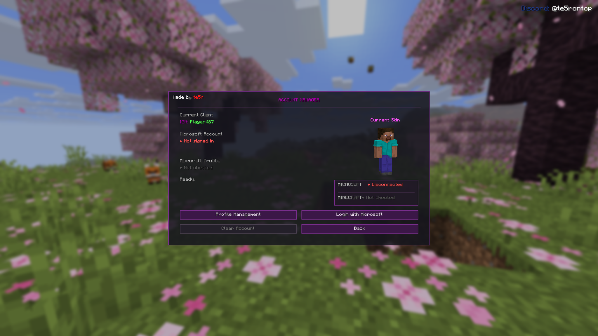
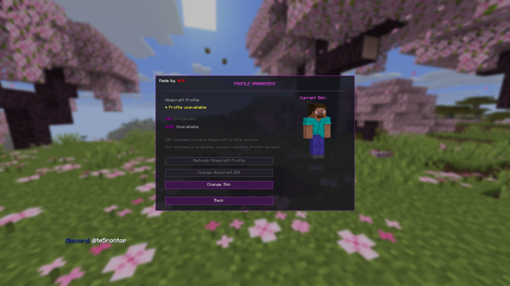
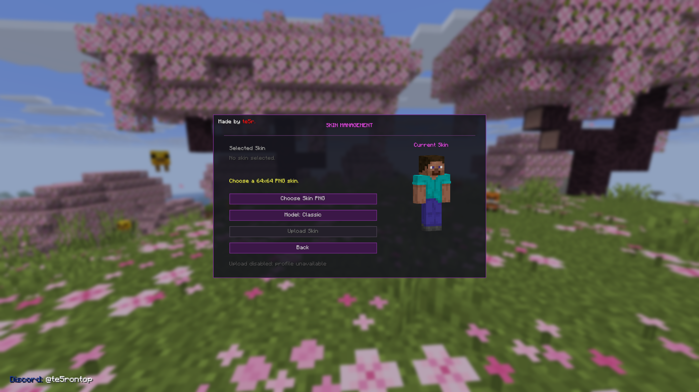

<div align="center">

# Account Manager

### Microsoft sign-in & Minecraft profile management for Fabric

[](https://github.com/te5rontop/Account-Manager/releases/latest)
[](https://github.com/te5rontop/Account-Manager/actions/workflows/build.yml)


[](https://github.com/te5rontop/Account-Manager/releases)

[**Download Latest Release**](https://github.com/te5rontop/Account-Manager/releases/latest) · [**Download v1.0.0 JAR**](https://github.com/te5rontop/Account-Manager/releases/download/v1.0.0/account-manager-1.0.0.jar) · [**Changelog**](CHANGELOG.md)

</div>

---

A client-side **Minecraft: Java Edition Fabric mod** focused on Microsoft sign-in and Minecraft profile management.

> **Minecraft version:** 26.1.2  
> **Fabric Loader:** 0.19.3+  
> **Java:** 25+  
> **Author:** te5r  
> **Discord:** `@te5rontop`

## Features

- Microsoft sign-in through the user's system browser
- Dedicated Account Manager interface in the Multiplayer screen
- Microsoft and Minecraft connection-status display
- Minecraft profile viewer with IGN, UUID and current skin preview
- Manual Minecraft profile refresh
- Minecraft IGN editor interface with local validation
- Skin PNG selection and validation
- 64x64 Minecraft skin preview
- Classic / Slim player model preview
- Minecraft skin upload integration when Minecraft Services access is available
- Minecraft IGN change integration when Minecraft Services access is available
- In-memory authentication state with no intentional token storage on disk
- Custom Account Manager UI and in-game branding

## Screenshots

### Account Manager



### Profile Management



### Skin Management



## Download

The recommended installation file is the normal release JAR:

**[Download Account Manager v1.0.0](https://github.com/te5rontop/Account-Manager/releases/download/v1.0.0/account-manager-1.0.0.jar)**

You can also browse all published versions on the **[Releases page](https://github.com/te5rontop/Account-Manager/releases)**.

Do not install a `-sources.jar` file as the normal mod.

## Current Minecraft Services Status

Microsoft OAuth sign-in is implemented and works through the standard Microsoft authentication flow.

Minecraft manually reviews new third-party applications that request access to the Java Edition game service APIs. Until this application's Microsoft Entra Client ID is approved and added to Minecraft's allow list, Minecraft profile-service features may display **App Not Authorized**.

The mod does **not** use another launcher's Client ID and does not attempt to bypass Minecraft Services application authorization.

## Installation

1. Install Minecraft: Java Edition **26.1.2**.
2. Install a compatible **Fabric Loader**.
3. Install **Fabric API** for the same Minecraft version.
4. Download the normal Account Manager JAR from this repository's **Releases** page.
5. Place the JAR inside your Minecraft instance's `mods` folder.
6. Launch Minecraft with the Fabric profile.

## Using Account Manager

Open:

`Multiplayer -> Account Manager`

From there you can sign in with Microsoft, inspect authentication status, open Profile Management, preview skins, validate Minecraft names, and refresh Minecraft profile information.

## Support & FAQ

### Why do I see `App Not Authorized`?

Account Manager's Microsoft authentication flow is implemented, but Minecraft Services access for new third-party applications is manually reviewed by Minecraft. Until this application is approved and allowlisted, Minecraft profile-service features may return `App Not Authorized`.

This can affect profile loading, IGN / UUID retrieval, skin uploading and Minecraft name changes. This notice will be updated once access is approved.

### Which Minecraft version is supported?

Account Manager v1.0.0 is built for **Minecraft: Java Edition 26.1.2**.

### Do I need Fabric API?

Yes. Install **Fabric Loader** and **Fabric API** for Minecraft 26.1.2 before launching the mod.

### Which Java version do I need?

Use **Java 25 or newer** for this release.

### Which file should I download?

Download the normal release file:

`account-manager-1.0.0.jar`

Do not install a `-sources.jar` as the normal mod.

### Where do I report a bug?

Contact me directly on Discord: **@te5rontop**.

Please include your Minecraft version, Fabric Loader version, Fabric API version, Java version, clear reproduction steps, and any relevant logs or screenshots. Never send Microsoft passwords, access tokens, refresh tokens, authorization codes, Xbox tokens, or XSTS tokens.

### Where do I request a feature?

Open the repository's **Issues** page and choose **Feature Request**.

### How should I report a security issue?

Do not post sensitive authentication or security details in a public issue. Follow the instructions in [SECURITY.md](SECURITY.md).

Never share Microsoft passwords, access tokens, refresh tokens, authorization codes, Xbox tokens or XSTS tokens.

### Is Account Manager affiliated with Mojang or Microsoft?

No. Account Manager is an independent community project and is not affiliated with, endorsed by, or sponsored by Mojang Studios, Microsoft, Xbox or Fabric.

## Security

Account Manager is designed as a public/native desktop OAuth client.

- Microsoft authentication is performed in the user's system browser.
- No client secret is embedded in the mod.
- Access tokens are intended to remain only in memory while Minecraft is running.
- Tokens are not intentionally displayed in the UI or written to local configuration files.
- Clearing the account state removes the mod's in-memory authentication state.

Never send Microsoft passwords, access tokens, refresh tokens, Xbox/XSTS tokens, or authorization codes to anyone claiming to provide support for this mod.

## Building from Source

Requirements:

- JDK 25
- Git
- A supported Gradle environment

Build with:

```bash
./gradlew build
```

On Windows PowerShell:

```powershell
.\gradlew.bat build
```

The compiled mod will be written to:

```text
build/libs/
```

## License

This repository is **source-available**, not OSI open source.

The source code is publicly visible for transparency, review and educational study, but modification, redistribution, reuploading, derivative works, substantial code reuse and commercial use are not permitted without explicit written permission from the copyright holder.

See [LICENSE](LICENSE) for the full terms.

## Disclaimer

Account Manager is an independent community project and is **not affiliated with, endorsed by, or sponsored by Mojang Studios, Microsoft, Xbox, or Fabric**.

Minecraft is a trademark of Microsoft Corporation.

---

<div align="center">

Made by **te5r.**  
Discord: **@te5rontop**

</div>
